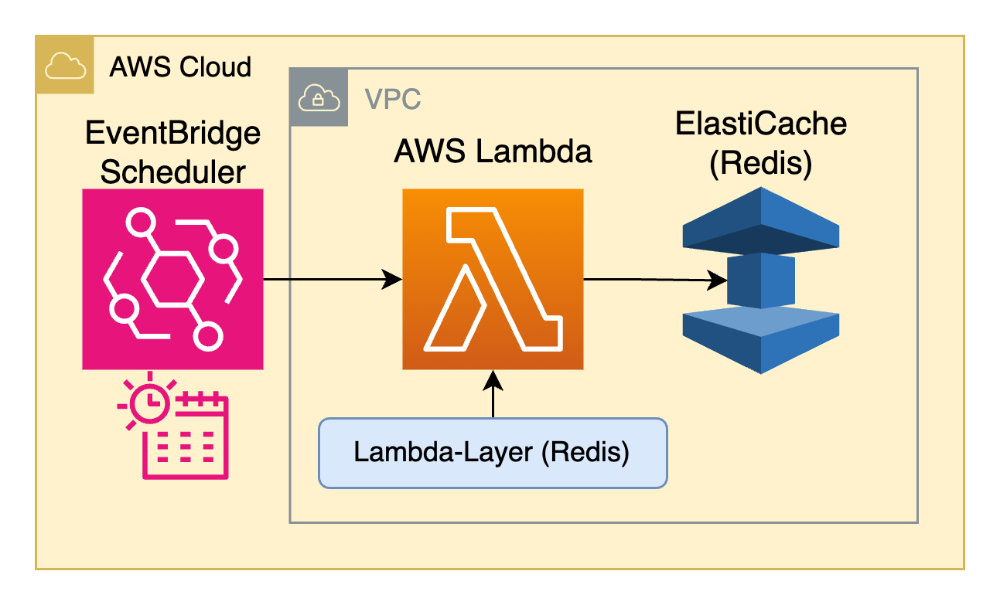
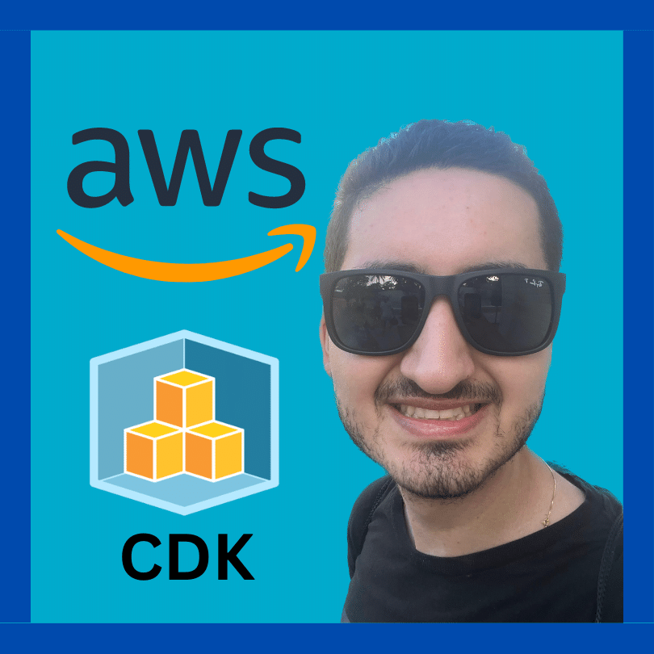

# 🧩 AWS-CDK-ELASTICACHE-EXPERIMENT 🧩

Redis experiments on top of Amazon ElastiCache and Lambda Functions for creating a cache/database solution with read/write functionalities (level 101 example for future reference).

## Summary/Overview :memo:

- Deployed on AWS with Infrastructure as Code on [CDK-Python](https://aws.amazon.com/cdk/).
- Cache and Primary Database with [Redis](https://redis.io).
- Unit and Integration Tests for the source code with [PyTest](https://docs.pytest.org/en/latest).

## AWS Architecture Diagram :trophy:

The AWS infrastructure solution is deployed with CDK-Python with the resources defined on the `cdk` folder:

 <br>

## Folders Explained :scroll:

This repository consists of multiple folders/files, which are explained as follows:

- Infrastructure as Code: ([`./cdk/`](./cdk/)).
- Source Code: ([`./src/`](./src/)).
- Python dependencies on top of custom Lambda Layers: ([`./lambda-layers`](./lambda-layers)).
- Tests: ([`./tests/`](./tests/))

## Usage :white_check_mark:

Follow these steps to configure the project locally:

### Clone the repository

First, clone the repository:

```bash
git clone https://github.com/san99tiago/aws-cdk-elasticache-experiment
cd aws-cdk-elasticache-experiment
```

### Configure CDK

Review the step by step commands for configuring the CDK at:

- [`./important_commands.sh`](./important_commands.sh)

> Note: python dependencies for this project are managed by [Poetry](https://python-poetry.org). Review [`./pyproject.toml`](pyproject.toml) for details.

> Note: for deploying or destroying the solution, see ("part 3") inside [`./important_commands.sh`](./important_commands.sh).

### Run the Lambda Function

Execute the Lambda Function with the following input events to see the Read/Write operations in action for the ElastiCache token:

UPDATE TOKEN:

```json
{
  "action": "write"
}
```

READ TOKEN:

```json
{
  "action": "read"
}
```

The logs and output should reflect the ElastiCache (Redis) functionality working as expected with 1-3 ms response times.

## Dependencies :100:

### Software

- [Visual Studio Code](https://code.visualstudio.com/) <br>
  Visual Studio Code is my main code editor for high-level programming. This is not absolutely necessary, but from my experience, it gives us a great performance and we can link it with Git and GitHub easily. <br>

- [Python](https://www.python.org/) <br>
  Python is a dynamic programming language that let us work fast, with easy and powerful integration of different software solutions. <br>

### Tools

- [CDK CLI (Toolkit)](https://docs.aws.amazon.com/cdk/v2/guide/cli.html) <br>
  To work with the CDK, it is important to install the main toolkit as a NodeJs global dependency. Please refer to the official AWS [Getting started with the AWS CDK](https://docs.aws.amazon.com/cdk/v2/guide/getting_started.html)<br>

- [AWS CLI](https://aws.amazon.com/cli/) <br>
  The AWS Command Line Interface (AWS CLI) is a unified tool to manage your AWS services. We will use it for connecting to our AWS account from the terminal (authentication and authorization towards AWS). <br>

## Special thanks :beers:

- I am grateful to the talented individuals who have dedicated their time and effort to develop the exceptional open-source projects that have been used in the creation of this solution. <br>

## Author :musical_keyboard:

**Santiago Garcia Arango**

<table border="1">
    <tr>
        <td>
            <p align="center"></p>
        </td>
        <td>
            <p align="center">As a curious DevOps Engineer, I am deeply passionate about implementing cutting-edge cloud-based solutions on AWS.<br> I firmly believe that today's greatest challenges must be solved by the expertise of individuals who are truly passionate about their work.
            </p>
        </td>
    </tr>
</table>

## LICENSE

Copyright 2023 Santiago Garcia Arango
